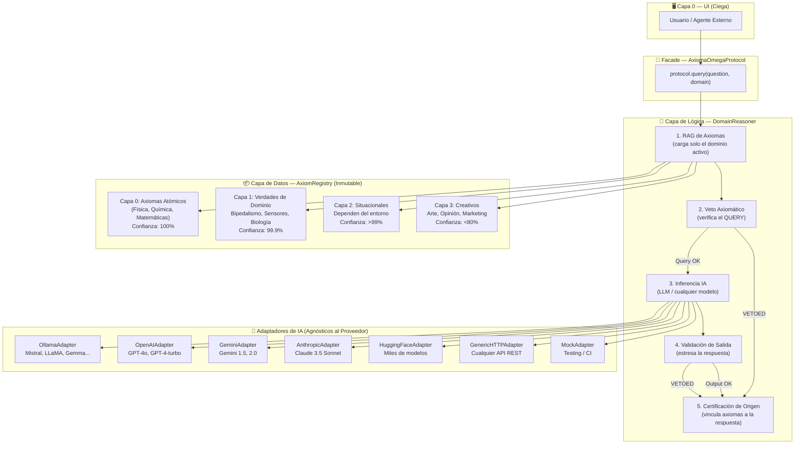
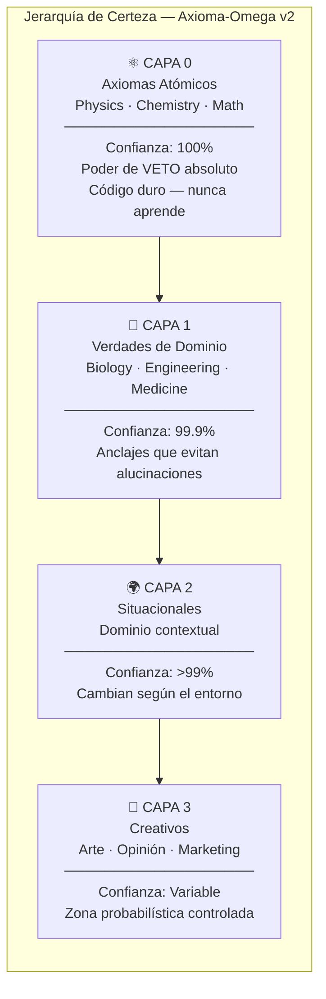
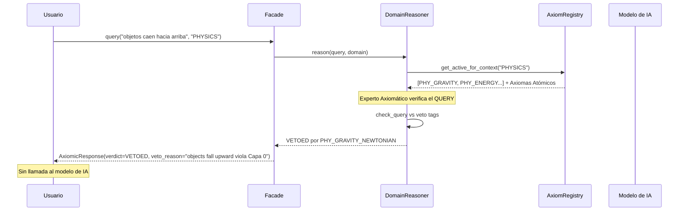
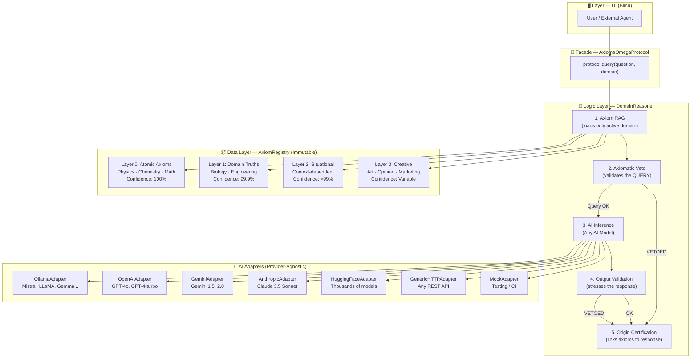

# Axioma-Omega Protocol

> **ES:** Un protocolo de razonamiento deductivo para modelos de IA que ancla las respuestas en verdades de dominio verificadas, elimina las alucinaciones por diseño y garantiza la soberanía de datos.
>
> **EN:** A deductive reasoning protocol for AI models that anchors responses in verified domain truths, eliminates hallucinations by design, and guarantees data sovereignty.

<div align="center">


</div>

---

## 🧲 Este proyecto evolucionó → [Omega-Cube Engine](https://github.com/Ping-iop/omega-cube-engine)

**Axioma-Omega** es la raíz académica: validación deductiva con veto axiomático.  
**Omega-Cube** es la evolución: 9 innovaciones — Tensor Hierarchies, Holographic Encoding, Quantum Annealing, Diffusion Sampling, Gray-Scale Validation, AutoResearch, PredictiveContextSearch (100% vs 50% flat), CollectiveEvolution, ProbabilisticHierarchy (4-layer Bayesian).  
📄 Paper · 🧪 Benchmarks · 🔓 Open source

---

## 🌐 Idiomas / Languages

- [🇪🇸 Español](#-documentación-en-español)
- [🇬🇧 English](#-english-documentation)

---

# 🇪🇸 Documentación en Español

## ¿Qué es el Protocolo Axioma-Omega?

La IA actual (LLMs) es **inductiva**: intenta deducir las leyes del universo analizando billones de datos. Esto genera:
- **Alucinaciones**: el modelo inventa hechos físicamente imposibles
- **Costo computacional masivo**: 80% del cómputo se gasta en mantener consistencia física básica
- **Opacidad**: no puedes saber por qué el modelo dio una respuesta

**Axioma-Omega** propone una arquitectura **deductiva**: el sistema parte de verdades verificadas (Axiomas) para filtrar y procesar la realidad. El modelo no *aprende* que el agua no fluye hacia arriba — el modelo *sabe* que es una precondición inamovible.

---

## Arquitectura del Protocolo

### Diagrama de Capas



### Jerarquía de Certeza



### Flujo del Veto Axiomático



---

## Providers de IA Soportados

| Provider | Modelo Ejemplo | Método Factory | Requisito |
|----------|---------------|----------------|-----------|
| **Ollama (Local)** | `mistral:latest`, `llama3:8b` | `create_with_ollama()` | `pip install openai` + Ollama |
| **OpenAI** | `gpt-4o`, `gpt-4-turbo` | `create_with_openai(api_key)` | `pip install openai` |
| **Google Gemini** | `gemini-1.5-flash`, `gemini-2.0` | `create_with_gemini(api_key)` | `pip install google-generativeai` |
| **Anthropic Claude** | `claude-3-5-sonnet` | `create_with_anthropic(api_key)` | `pip install anthropic` |
| **HuggingFace** | `Mistral-7B-Instruct` | `create_with_huggingface(api_key)` | `pip install huggingface-hub` |
| **HTTP Genérico** | Cualquier API REST | `create_with_custom_api(endpoint)` | `pip install requests` |
| **Mock (Testing)** | Respuestas determinísticas | `create_for_testing()` | Sin dependencias |

---

## Instalación

```bash
git clone https://github.com/Ping-iop/Axioma-Omega_Protocol
cd axioma-omega-protocol

# Dependencias base (sin proveedor de IA)
pip install -r requirements.txt

# Para Ollama (modelos locales)
pip install openai

# Para Gemini
pip install google-generativeai

# Para Claude
pip install anthropic

# Para HuggingFace
pip install huggingface-hub
```

---

## Uso Rápido

```python
from src.protocol import AxiomaOmegaProtocol

# ─── Con Ollama (local, gratis, sin enviar datos) ───
protocol = AxiomaOmegaProtocol.create_with_ollama(model="mistral:latest")

# ─── Con Google Gemini ───
protocol = AxiomaOmegaProtocol.create_with_gemini(api_key="TU_API_KEY")

# ─── Con Claude ───
protocol = AxiomaOmegaProtocol.create_with_anthropic(api_key="TU_API_KEY")

# ─── Consulta con validación axiomática ───
response = protocol.query(
    question="¿Cómo se movería un humano en Marte?",
    domain="BIOLOGY_HUMAN",
    env_vars={"gravity_ms2": 3.72},  # Condición de contorno: gravedad marciana
)

print(response.content)          # Respuesta validada
print(response.verdict.name)     # APPROVED / VETOED / FLAGGED
print(response.confidence_score) # Score compuesto de certeza
print(response.supporting_axioms)# Certificación de origen: qué axiomas la sustentan
```

### Axioma Personalizado

```python
from src.core.axiom_registry import Axiom, AxiomLayer

protocol.add_custom_axiom(Axiom(
    axiom_id="ENG_GPU_PARALLELISM",
    domain="ENGINEERING_AI",
    layer=AxiomLayer.DOMAIN,
    statement="Las GPUs ejecutan miles de ops en paralelo vía SIMD.",
    formal_rule="GPU.paradigm = SIMD; throughput >> CPU_single_thread",
    confidence=0.999,
    sources=("NVIDIA CUDA Docs",),
    tags=frozenset({"gpu", "engineering", "parallelism"}),
))
```

---

## Conceptos Clave

### Veto Axiomático
Los axiomas de Capa 0 tienen **poder de veto absoluto**. Si un prompt o respuesta viola una ley física, el sistema bloquea la respuesta **por imposibilidad lógica**, no por "ética programada". Esto lo hace inmune a inyecciones de prompt.

### Condiciones de Contorno
Las verdades cambian con el contexto. A 300 atm de presión sin luz, la fotosíntesis se desactiva y la quimiosíntesis se activa automáticamente.

### Certificación de Origen
Cada `AxiomicResponse` incluye `supporting_axioms` — los IDs de los axiomas que sustentan la respuesta. El usuario puede auditar la base lógica de cualquier output.

### Edge AI Ready
El núcleo axiomático es matemático, no estadístico. Es lo suficientemente ligero para correr en dispositivos locales con Ollama sin enviar datos a servidores externos.

---

# 🇬🇧 English Documentation

## What is the Axioma-Omega Protocol?

Current AI (LLMs) is **inductive**: it tries to deduce the laws of the universe by analyzing billions of data points. This leads to:
- **Hallucinations**: the model invents physically impossible facts
- **Massive computational cost**: 80% of compute is spent maintaining basic physical consistency
- **Opacity**: you cannot know *why* the model gave a specific answer

**Axioma-Omega** proposes a **deductive** architecture: the system starts from verified truths (Axioms) to filter and process reality. The model doesn't *learn* that water doesn't flow uphill — the model *knows* it as an immovable precondition.

---

## Protocol Architecture

### Layer Diagram



---

## Supported AI Providers

| Provider | Example Model | Factory Method | Requirement |
|----------|--------------|----------------|-------------|
| **Ollama (Local)** | `mistral:latest`, `llama3:8b` | `create_with_ollama()` | `pip install openai` + Ollama |
| **OpenAI** | `gpt-4o`, `gpt-4-turbo` | `create_with_openai(api_key)` | `pip install openai` |
| **Google Gemini** | `gemini-1.5-flash` | `create_with_gemini(api_key)` | `pip install google-generativeai` |
| **Anthropic Claude** | `claude-3-5-sonnet` | `create_with_anthropic(api_key)` | `pip install anthropic` |
| **HuggingFace** | `Mistral-7B-Instruct` | `create_with_huggingface(api_key)` | `pip install huggingface-hub` |
| **Generic HTTP** | Any REST API | `create_with_custom_api(endpoint)` | `pip install requests` |
| **Mock (Testing)** | Deterministic | `create_for_testing()` | No dependencies |

---

## Quick Start

```python
from src.protocol import AxiomaOmegaProtocol

# ─── With Ollama (local, free, data stays on device) ───
protocol = AxiomaOmegaProtocol.create_with_ollama(model="mistral:latest")

# ─── With Google Gemini ───
protocol = AxiomaOmegaProtocol.create_with_gemini(api_key="YOUR_API_KEY")

# ─── With Claude ───
protocol = AxiomaOmegaProtocol.create_with_anthropic(api_key="YOUR_API_KEY")

# ─── Axiom-grounded query ───
response = protocol.query(
    question="How would a human move on Mars?",
    domain="BIOLOGY_HUMAN",
    env_vars={"gravity_ms2": 3.72},  # Boundary condition: Martian gravity
)

print(response.content)           # Validated response
print(response.verdict.name)      # APPROVED / VETOED / FLAGGED
print(response.confidence_score)  # Composite certainty score
print(response.supporting_axioms) # Origin certification: which axioms support it
```

---

## Key Concepts

### Axiomatic Veto
Layer-0 axioms hold **absolute veto power**. If a prompt or response violates a physical law, the system blocks it **due to logical impossibility**, not "programmed ethics". This makes it immune to prompt injection attacks.

### Boundary Conditions
Truths change with context. At 300 atm pressure with no light, photosynthesis is automatically deactivated and chemosynthesis is activated.

### Origin Certification
Every `AxiomicResponse` includes `supporting_axioms` — the IDs of the axioms that back the response. Users can audit the logical basis of any AI output.

### Edge AI Ready
The axiom core is mathematical, not statistical. It's lightweight enough to run on local devices with Ollama without sending data to external servers.

---

## Project Structure

```
Axioma-Omega_Protocol/
├── src/
│   ├── core/
│   │   ├── axiom_registry.py    # Immutable axiom store (Data Layer)
│   │   └── domain_reasoner.py   # Deductive engine + MoE + Veto (Logic Layer)
│   ├── axioms/
│   │   └── standard_library.py  # 12 pre-loaded axioms (Physics, Biology, Chemistry)
│   ├── adapters/
│   │   └── llm_adapter.py       # 7 AI provider adapters (provider-agnostic)
│   └── protocol.py              # Public facade (single entry point)
├── demo.py                      # 7 runnable demos (no external LLM required)
├── Documentation/               # Original theoretical documents
└── README.md
```

---

## Run the Demo (No AI backend needed)

```bash
python -X utf8 demo.py
```

Expected output includes:
- **DEMO 2**: Normal query → `APPROVED`
- **DEMO 3**: Malicious prompt ("objects fall upward") → `VETOED` by Layer-0 axiom
- **DEMO 4**: Boundary conditions at 300 atm changing active axioms
- **DEMO 5**: Runtime custom axiom registration
- **DEMO 7**: Batch query processing

---

## Agradecimientos / Acknowledgments

> **ES:** Este proyecto se inspira profundamente en el trabajo y la visión de dos pioneros de la Inteligencia Artificial cuyas ideas fundacionales resonaron en el diseño de este protocolo.
>
> **EN:** This project is deeply inspired by the work and vision of two AI pioneers whose foundational ideas resonated throughout the design of this protocol.

### [Andrej Karpathy](https://github.com/karpathy) — [@karpathy](https://github.com/karpathy)

> **ES:** Por democratizar el entendimiento profundo de las redes neuronales y el aprendizaje automático. Sus conferencias, proyectos open-source (nanoGPT, minGPT, llm.c) y su filosofía de "software 2.0" fueron catalizadores directos en la concepción de un paradigma que busca hacer la IA más eficiente y transparente. Su trabajo demuestra que la verdadera innovación viene de entender los cimientos, no de escalar la fuerza bruta.
>
> **EN:** For democratizing deep understanding of neural networks and machine learning. His lectures, open-source projects (nanoGPT, minGPT, llm.c), and his "Software 2.0" philosophy were direct catalysts in conceiving a paradigm that seeks to make AI more efficient and transparent. His work proves that true innovation comes from understanding foundations, not from scaling brute force.

### [Demis Hassabis](https://github.com/DemisHassabis) — [@DemisHassabis](https://github.com/DemisHassabis)

> **ES:** Por liderar la frontera de la IA para el descubrimiento científico en Google DeepMind. AlphaFold demostró que anclar la IA en las leyes de la física y la biología produce resultados que trascienden la estadística pura — exactamente la tesis central de Axioma-Omega. Su visión de una AGI que amplifica la capacidad humana para entender el universo es el norte filosófico de este protocolo.
>
> **EN:** For leading the frontier of AI for scientific discovery at Google DeepMind. AlphaFold demonstrated that grounding AI in the laws of physics and biology produces results that transcend pure statistics — exactly the central thesis of Axioma-Omega. His vision of an AGI that amplifies humanity's capacity to understand the universe is the philosophical north star of this protocol.

---

## License

MIT © Axioma-Omega Protocol Contributors

---

<div align="center">
<i>"Pasamos de una IA que adivina a una IA que deduce."<br/>
"From an AI that guesses to an AI that deduces."</i>
</div>
